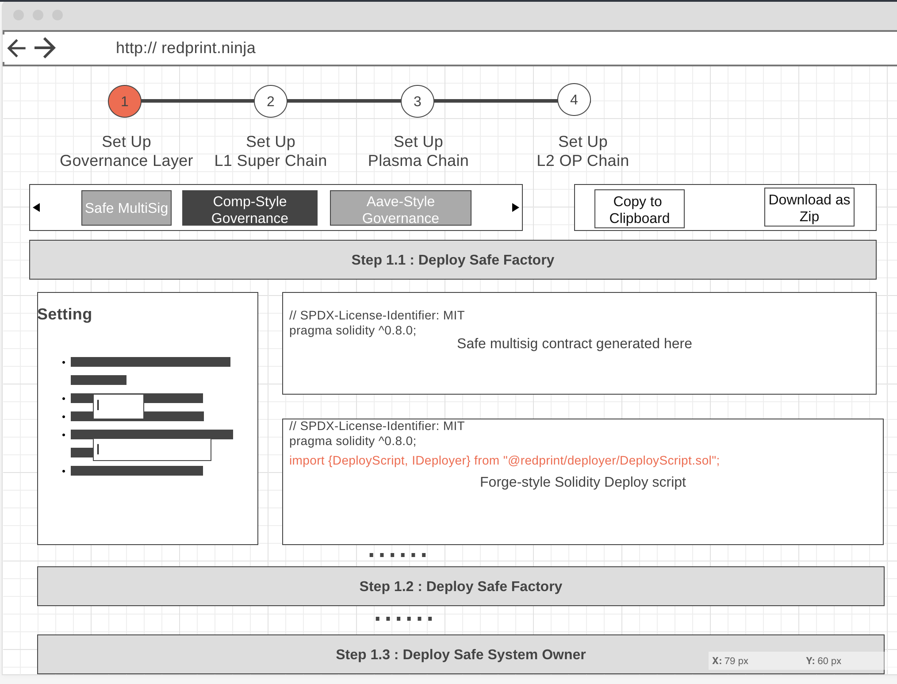

<h1>📚 OPStack Contracts 's Deployment Pipline using `redprint-forge` 's POC 📚</h1>

An PoC showing how `Redprint` works. This developer toolkit includes interactive code generator and template to modify & deploy OPstack ’s smart contract components in modular style

> **Note**💡

> The code is not audited yet. Please use it carefully in production.

- [What is it for](#what-is-it-for)
- [How It Works](#how-it-works)
- [Benchmarks](#benchmarks)
- [Installation](#installation)
- [Quickstart](#quickstart)
- [Contributing](#contributing)
- [Architecture](#architecture)

## What is it for ?

This OP-Stack-oriented App-chain building block is intended to better introduce and onboard blockchain builder into Optimism 's [Superchain Ecosystem](https://docs.optimism.io/stack/explainer).

> **Note**💡

**The OP Stack can be thought of as software components that either help define a specific layer of the Optimism ecosystem or fill a role as a module within an existing layer.**


While developer experience is our top priority, we aim to provide the developer-focused educational tool, such that the new experiment layer2 or Appchain can be quicky bootstapped in superchain community & ecosystem.

## How It Works

`Redprint` consists of:

1. **Redprint Wizard** (Web UI)

We are building `Redprint Wizard`, a web application to interactively customize, mix & match, deploy L2 OPStack chain/ App-chain.

It can be as educational platform to explore and select different versions of smart contract components for different usecases/features. Then, the `Redprint` will generate all required solidity code, including both smart contract parts and their relevant deploy scripts.

By way of illustration, this is a **low-fidelity wireframe** showing how it works:



It can be seen above that the developers have several options to choose their own desired layer. In our example, it is **the governance layer** and the [`Safe's Multi-sig`](https://github.com/safe-global/safe-smart-account) is chosen over other Governor-style contract systems.

Another example is **Compound-style contract**. Different sets of parameters can be selected based on the preference. This includes **voting delay**, **voting period**, **time lock period** and etc.

## Quick Start

1. Copy [`.env`](./.env) into `.env.<network>.local` and modify as required. For example, this is a file (`.env.optimism.local`)(https://github.com/Ratimon/optimism-contracts-foundry/.env.optimism.local) for optimism network:

> **Note**💡

More style and convention guide for environment variable management can be found here : [ldenv](https://github.com/wighawag/ldenv)

```sh
# -------------------------------------------------------------------------------------------------
# IMPORTANT!
# -------------------------------------------------------------------------------------------------
# USE .env.local and .env.<context>.local to set secrets
# .env and .env.<context> are used for default public env
# -------------------------------------------------------------------------------------------------

RPC_URL_localhost=http://localhost:8545

#secret management
MNEMONIC="test test test test test test test test test test test junk"
DEPLOYER=0x70997970C51812dc3A010C7d01b50e0d17dc79C8
# local network 's default private key so it is still not exposed
DEPLOYER_PRIVATE_KEY=ac0974bec39a17e36ba4a6b4d238ff944bacb478cbed5efcae784d7bf4f2ff80
ENV_MODE=DEPLOYMENT_CONTEXT

# script/Config.sol
DEPLOYMENT_OUTFILE=deployments/31337/.save.json
DEPLOY_CONFIG_PATH=
CHAIN_ID=
CONTRACT_ADDRESSES_PATH=deployments/31337/.save.json
DEPLOYMENT_CONTEXT=localhost
IMPL_SALT=
STATE_DUMP_PATH=
SIG=
DEPLOY_FILE=
DRIPPIE_OWNER_PRIVATE_KEY=9000

# deploy-Config
GS_ADMIN_ADDRESS=0x70997970C51812dc3A010C7d01b50e0d17dc79C8
GS_BATCHER_ADDRESS=0x70997970C51812dc3A010C7d01b50e0d17dc79C8
GS_PROPOSER_ADDRESS=0x70997970C51812dc3A010C7d01b50e0d17dc79C8
GS_SEQUENCER_ADDRESS=0x70997970C51812dc3A010C7d01b50e0d17dc79C8
L1_RPC_URL=http://localhost:8545
```

> **Note**💡

`deployments/31337/.deploy` is case sensitive.

2. Run solidity deploymemt scripts:

These following commands will save deployment artifacts at [`deployments/<chain-id>/`](./deployments/.save.json)

There are two ways:

- Deploy each of individual components:

```bash
pnpm deploy_100_safe
```

```bash
pnpm deploy_201_address_manager
```

```bash
pnpm deploy_202_proxy_admin
```

- Alternatively, Deploy each set of contracts :

```bash
pnpm setup_200_superchain
```

or deploy all of them in single script:

```bash
pnpm deploy_000_all
```

> **Note**💡

The first digit represents the higher level of deployment logic, compared to the last degits. For example, `setup_200_superchain` whose number is `200` includes all of scripts whose numbers starting with `2XX` (e.g. `201` or `deploy_201_address_manager`).

## Quick Installation

### zellij

[zellij](https://zellij.dev/) is a useful multiplexer (think tmux) for which we have included a [layout file](./zellij.kdl) to get started

Once installed simply run:

```bash
nvm use 18.17.0
forge init optimism-contracts-foundry
```

```bash
cd optimism-contracts-foundry
pnpm init
```

## How to use?

### Test your contracts

```bash
pnpm test
```
